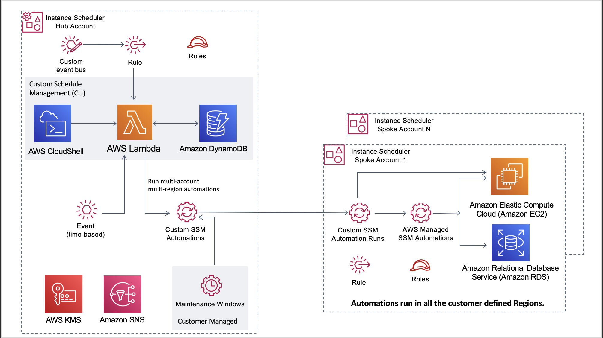

** [AWS Instance Scheduler](https://aws.amazon.com/solutions/implementations/instance-scheduler) | **[🚧 Feature request](https://github.com/awslabs/aws-instance-scheduler/issues/new?assignees=&labels=feature-request%2C+enhancement&template=feature_request.md&title=)** | **[🐛 Bug Report](https://github.com/awslabs/aws-instance-scheduler/issues/new?assignees=&labels=bug%2C+triage&template=bug_report.md&title=)**

Note: If you want to use the solution without building from source, navigate to Solution Landing Page

## Table of contents

- [Solution Overview](#solution-overview)
- [Architecture Diagram](#architecture-diagram)
- [AWS CDK Constructs](#aws-solutions-constructs)
- [Customizing the Solution](#customizing-the-solution)
  - [Prerequisites for Customization](#prerequisites-for-customization)
  - [Build](#build)
  - [Unit Test](#unit-test)
  - [Deploy](#deploy)
- [File Structure](#file-structure)
- [License](#license)

<a name="solution-overview"></a>
# Solution Overview
Solution for Cross-Account and Cross-Region scheduling EC2 and RDS instances/clusters using SSM Automation Runbooks.

<a name="architecture-diagram"></a>
# Architecture Diagram


<a name="prerequisites-for-customization"></a>
## Prerequisites for Customization
* Node.js>12
* Python >3.7

<a name="build"></a>

AWS Solutions use two buckets: a bucket for global access to templates, which is accessed via HTTPS, and regional buckets for access to assets within the region, such as Lambda code. You will need:

- One global bucket that is access via the http end point. AWS CloudFormation templates are stored here. It must end with "-reference. Ex. "mybucket-reference"
- One regional bucket for each region where you plan to deploy using the name of the global bucket as the root, and suffixed with the region name. Ex. "mybucket-us-east-1"
- Your buckets should be encrypted and disallow public access

**Note**: When creating your buckets, ensure they are not publicly accessible. Use random bucket names. Disable public access. Use KMS encryption. And verify bucket ownership before uploading.

## Build
Build the CDK code
```
cd source/
npm run build
```
Build the templates for custom deployments
* Configure the bucket name of your target Amazon S3 distribution bucket
```
export BUCKET-NAME-PREFIX=[RANDOM_BUCKET_NAME] 
export DIST_SOLUTION_BUCKET=$BUCKET-NAME-PREFIX-[REGION]
export SOLUTION_NAME=my-solution-name
export VERSION=my-version # version number for the customized code
export REGION=aws-region-code # e.g. us-east-1
```


* Now build the distributable:
```
chmod +x ./build-s3-dist.sh
./build-s3-dist.sh $BUCKET-NAME-PREFIX $SOLUTION_NAME $VERSION
```
<a name="unit-test"></a>
```
cd ./deployment
chmod +x ./run-unit-tests.sh
./run-unit-tests.sh
```

<a name="deploy"></a>
## Deploy
Follow the steps for deploying your custom version of the solution.
* Create a random S3 bucket with the bucket appended with the region in which the deployment is to be made. example, if the deployment is to be made in us-east-1 create a bucket name as [BUCKET-NAME-PREFIX]-us-east-1.
* Create the distribution files using the script provided in the build section above.
* Create the S3 Key in the bucket aws-instance-scheduler/[VERSION_ID]/
* Copy the file ./deployment/regional-s3-assets/instance-scheduler.zip to the location s3://[BUCKET-NAME-PREFIX]-[REGION]/aws-instance-scheduler/[VERSION_ID]/

Once the above steps are completed, use the file ./deployment/global-s3-assets/aws-instance-scheduler.template to create a stack in CloudFormation.


<a name="file-structure"></a>
# File structure

aws-instance-scheduler consists of:

- CDK constructs to generate necessary resources
- Microservices used in the solution

## File Structure

<prev>
|- deployment/                - contains build scripts, deployment templates, and dist folders for staging assets.
  |- build-s3-dist.sh         - builds the solution and copies artifacts to the appropriate /global-s3-assets or /regional-s3-assets folders.
  |- run-unit-tests.sh         - runs the unit tests for the lambda files.
|- source/                    - all source code, scripts, tests, etc.
  |- bin/
    |- aws-instance-scheduler.ts - the AWS Instance scheduler cdk app.
  |- cli/                     - scheduler-cli source files.
  |- lambda/                  - Lambda function with source code and test cases.        
  |- lib/
    |- aws-instance-scheduler-stack.ts  - the main CDK stack for aws instance scheduler solution.
    |- aws-instance-scheduler-remote-stack.ts  - the main CDK stack for aws instance scheduler solution remote template.
    |- event-bus-stack.ts  - the main CDK stack for the AWS event bus component for Organizations.
    |- ssm-documents-stack-stack.ts  - the CDK stack for ssm documents used by the solution.
  |- runbooks
    |- ssm-py-scripts
      |- __init__.py
      |- start_secondary_ssm_automation_aurora_cluster.py - microservice executed in the ssm runbook for scheduling RDS Aurora clusters.
      |- start_secondary_ssm_automation_rds_instance.py -  microservice executed in the ssm runbook for scheduling RDS instances.
    |- AWS-StopRdsInstance.yaml - 
    |- Scheduler-StartTaggedEC2Instances.yaml - custom ssm automation runbook to start tagged ec2 instances.
    |- Scheduler-StopTaggedEC2Instances.yaml - custom ssm automation runbook to stop tagged ec2 instances.
    |- Scheduler-StartTaggedRDSInstances.yaml - custom ssm automation runbook to start tagged rds instances.
    |- Scheduler-StopTaggedRDSInstances.yaml - custom ssm automation runbook to stop tagged rds instances.
    |- Scheduler-StartTaggedRDSClusters.yaml - custom ssm automation runbook to start tagged rds clusters.
    |- Scheduler-StopTaggedRDSClusters.yaml - custom ssm automation runbook to stop tagged rds clusters.
  |- test/
    |- __snapshots__/
    |- aws-instance-scheduler-remote-stack.test.ts   - unit and snapshot tests for aws instance scheduler remote stack.
    |- aws-instance-scheduler-stack.test.ts   - unit and snapshot tests for aws instance scheduler.
  |- cdk.json                 - config file for CDK.
  |- jest.config.js           - config file for unit tests.
  |- package.json             - package file for the aws instance scheduler CDK project.
  |- run-all-tests.sh         - runs all tests within the /source folder. Referenced in the buildspec and build scripts.
  |- tsconfig.json            - typescript configurations.
|- .gitignore
|- CHANGELOG.md               - required for every solution to include changes based on version to auto-build release notes.
|- CODE_OF_CONDUCT.md         - standardized open source file for all solutions.
|- CONTRIBUTING.md            - standardized open source file for all solutions.
|- LICENSE.txt                - required open source file for all solutions - should contain the Apache 2.0 license.
|- NOTICE.txt                 - required open source file for all solutions - should contain references to all 3rd party libraries.
|- README.md                  - required file for all solutions.

</pre>

## Collection of operational metrics
This solution collects anonymous operational metrics to help AWS improve the quality and features of the solution. For more information, including how to disable this capability, please see the [implementation guide](https://docs.aws.amazon.com/solutions/latest/instance-scheduler/collection-of-operational-metrics.html).

<a name="license"></a>
***

Copyright 2021 Amazon.com, Inc. or its affiliates. All Rights Reserved.

Licensed under the Apache License Version 2.0 (the "License"). You may not use this file except in compliance with the License. A copy of the License is located at

    http://www.apache.org/licenses/

or in the "license" file accompanying this file. This file is distributed on an "AS IS" BASIS, WITHOUT WARRANTIES OR CONDITIONS OF ANY KIND, express or implied. See the License for the specific language governing permissions and limitations under the License.

See [LICENSE](https://github.com/awslabs/aws-instance-scheduler/blob/master/LICENSE.txt)